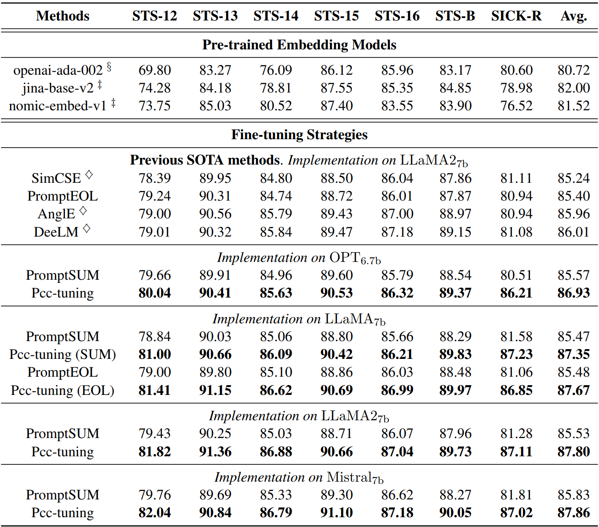

# Read Me

[Pcc-tuning: Breaking the Contrastive Learning Ceiling in Semantic Textual Similarity](https://arxiv.org/abs/2406.09790)

_Our paper is the first to propose and substantiate the theoretical performance upper bound of contrastive learning methods. Additionally, Pcc-tuning is the inaugural method capable of achieving Spearman’s correlation scores above 87 on standard STS tasks, marking a significant advancement in the field._

__This paper has been accepted to EMNLP 2024. (Main)__

***

## Results



***

## Data

- Stage one: `nli_for_simcse.csv`
- Stage two: `merged-SICK-STS-B-train.jsonl`
- Link: https://drive.google.com/drive/folders/1M6zXUQ-XCe7bgYD6th6T-5mCInpnUwbV?usp=sharing

***

## Checkpoints

- Link: https://drive.google.com/drive/folders/1jTtORca1ihHlpdFfSpwsSgmcL6KrukjM?usp=sharing

***

## Quick Start

- Python Version: 3.9.18

- Install Dependencies

  ```bash
  cd code
  pip install -r requirements.txt
  ```

- Download SentEval

  ```bash
  cd SentEval/data/downstream/
  bash download_dataset.sh
  ```
  
- Stage One

  ```bash
  cd code
  nohup torchrun --nproc_per_node=4 train.py > nohup.out & # 4090 * 4
  ```

- Stage Two

  ```bash
  cd code
  nohup torchrun --nproc_per_node=4 tune.py > nohup.out & # 4090 * 4
  ```

## Acknowledgement

- Our code is based on PromptEOL

## Related Work

- Github: [STS-Regression](https://github.com/ZBWpro/STS-Regression)

  Paper: [Advancing Semantic Textual Similarity Modeling: A Regression Framework with Translated ReLU and Smooth K2 Loss](https://arxiv.org/abs/2406.05326)

  Conference::star2: EMNLP 2024, **Main**
- Github: [CoT-BERT](https://github.com/ZBWpro/CoT-BERT)

  Paper: [CoT-BERT: Enhancing Unsupervised Sentence Representation through Chain-of-Thought](https://arxiv.org/abs/2309.11143) 

  Conference::star2: ICANN 2024, **Oral**
- Github: [PretCoTandKE](https://github.com/ZBWpro/PretCoTandKE)

  Paper: [Simple Techniques for Enhancing Sentence Embeddings in Generative Language Models](https://arxiv.org/abs/2404.03921)​ 

  Conference::star2: ICIC 2024, **Oral**
