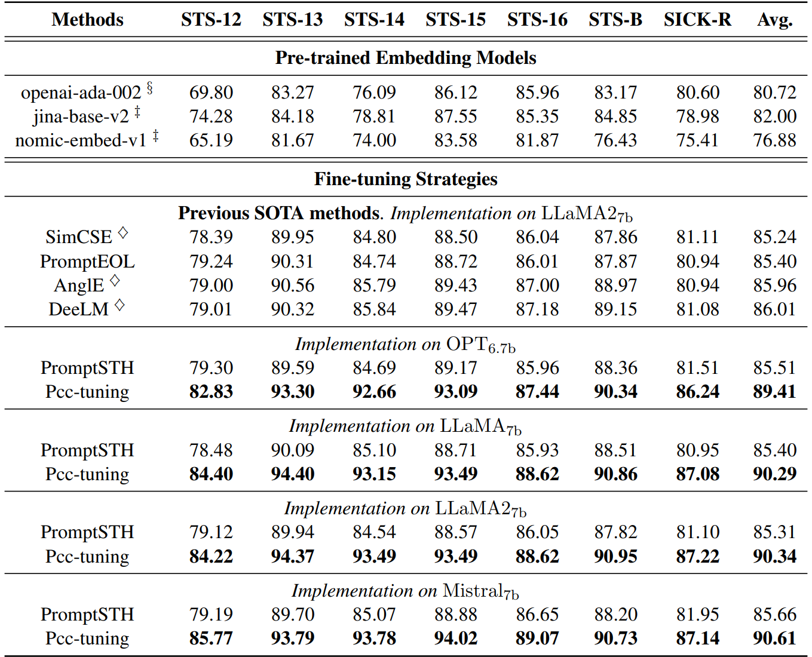

# Read Me

Pcc-tuning: Breaking the Contrastive Learning Ceiling in Semantic Textual Similarity

_our paper is the first to propose and substantiate the performance upper bound of contrastive learning methods. Additionally, Pcc-tuning is the inaugural method capable of achieving Spearman's correlation scores above 87 on standard STS tasks, marking a significant advancement in the field._

***

## Results



***

## Data

- Stage one: `nli_for_simcse.csv`
- Stage two: `stsb-sickr-train.jsonl`
- Link: https://drive.google.com/drive/folders/1qDEFOEkkZfFn9RfFi2ibMo_uuIDk-Vr1?usp=sharing

***

## Checkpoints

- Link: https://drive.google.com/drive/folders/1jTtORca1ihHlpdFfSpwsSgmcL6KrukjM?usp=sharing

***

## Quick Start

- Python Version: 3.9.18

- Install Dependencies

  ```bash
  cd code
  pip install -r requirements.txt
  ```

- Download SentEval

  ```bash
  cd SentEval/data/downstream/
  bash download_dataset.sh
  cd -
  cd ./data
  bash download_nli.sh
  cd -
  ```

- stage one

  ```bash
  cd code
  nohup torchrun --nproc_per_node=4 train.py > nohup.out &
  ```

- stage two

  ```bash
  cd code
  nohup torchrun --nproc_per_node=4 tune.py > nohup.out &
  ```

## Acknowledgement

- Our code is based on PromptEOL

## Friendship Link

- [CoT-BERT](https://github.com/ZBWpro/CoT-BERT): State-of-the-Art :star2: <u>unsupervised</u> sentence representation scheme based on <u>discriminative</u> pre-trained language models (BERT, RoBERTa). [CoT-BERT: Enhancing Unsupervised Sentence Representation through Chain-of-Thought](https://arxiv.org/abs/2309.11143)
- [STS-Regression](https://github.com/ZBWpro/STS-Regression): State-of-the-Art :star2: <u>supervised</u> sentence representation scheme based on <u>discriminative</u> pre-trained language models (BERT, RoBERTa). [Advancing Semantic Textual Similarity Modeling: A Regression Framework with Translated ReLU and Smooth K2 Loss](https://arxiv.org/abs/2406.05326)
- [PretCoTandKE](https://github.com/ZBWpro/PretCoTandKE): State-of-the-Art :star2: ​<u>direct inference</u> scheme for sentence embeddings based on <u>generative</u> pre-trained language models (OPT, LLaMA, LLaMA2, Mistral). [Simple Techniques for Enhancing Sentence Embeddings in Generative Language Models](https://arxiv.org/abs/2404.03921)
- [Pcc-tuning](https://github.com/ZBWpro/Pcc-tuning): State-of-the-Art :star2: ​<u>supervised</u> sentence representation scheme based on <u>generative</u> pre-trained language models (OPT, LLaMA, LLaMA2, Mistral). [Pcc-tuning: Breaking the Contrastive Learning Ceiling in Semantic Textual Similarity](https://arxiv.org/abs/2406.09790)
